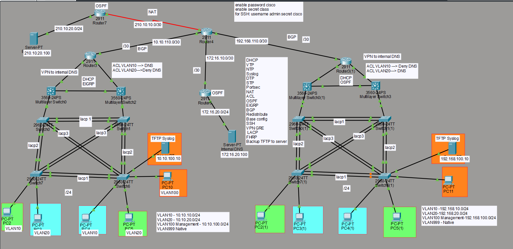

#  Enterprise Network Lab (Cisco Packet Tracer)

## Note
This project was developed as part of a university coursework. The implementation, configuration, and testing were completed independently.

It demonstrates real-world network design using Layer 2 and Layer 3 technologies, routing protocols, security policies, and infrastructure services.

---

##  Implemented Technologies

###  Layer 2
- VLAN (10, 20, 100, 999)
- Trunking (802.1Q)
- STP (Spanning Tree Protocol)
- EtherChannel (LACP)
- VTP (VLAN Trunking Protocol)
- Port Security (MAC address control on access ports)  

---

###  Layer 3
- Inter-VLAN Routing (SVI)
- OSPF
- EIGRP
- BGP
- Route redistribution 

---

### Network Services
- DHCP
- DNS (Internal Server)
- NTP
- Syslog
- TFTP

---

###  Security
- ACL (Access Control Lists)
- Port Security (restricting unauthorized devices)
- VLAN segmentation
- SSH remote access

---

### Additional Features
- NAT
- Site-to-Site VPN
- HSRP (High Availability)
- Configuration backup to TFTP server

---

##  Network Topology

